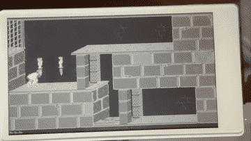
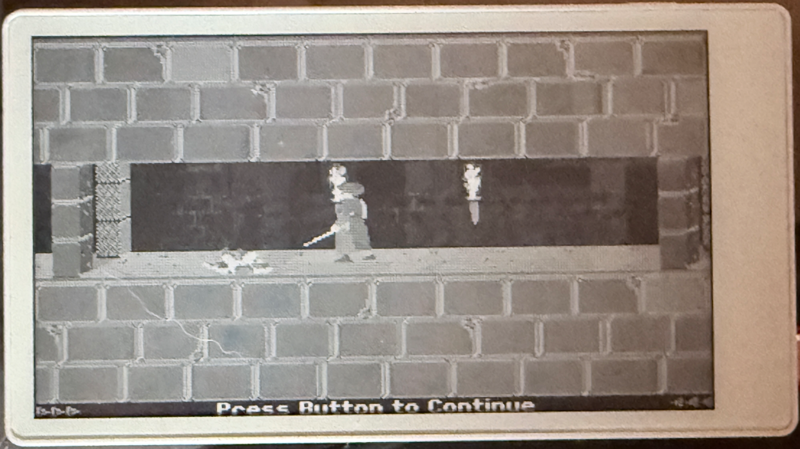
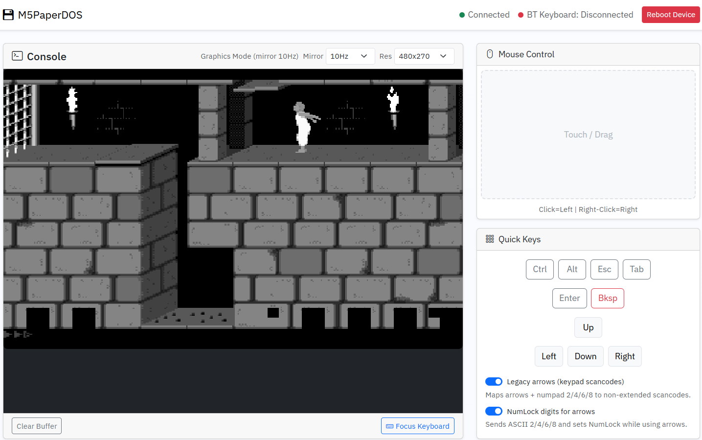

# M5PaperDOS 🖥️📟

<p align="center">
  
  <div style="display:flex; gap:12px; justify-content:center; margin-top:12px;">
    
    
  </div>
</p>

(Note: Most of the code was written by LLMs including the emojies here)

## Description ✨

**M5PaperDOS** is an embedded 8086/DOS emulator targeted at the M5Paper family (including the M5Paper S3). It brings a vintage PC experience to your e-paper device by emulating an Intel 8086 CPU, basic BIOS/DOS subsystems, and common disk utilities — all running under ESP-IDF on the M5 hardware.

## Prime Features ✅

- **8086 CPU emulation** (core opcode decode/execute in `main/dos/cpu8086.c`) 🔌
- **Embedded BIOS + DOS support** (`main/emulator/`) 🧭
- **SD card disk image support** — place `msdos.img` on the SD card for booting 💾
- **EPD display integration** via our EPD driver (`main/display/epd_driver.c`) 🖼️
- **Keyboard & input support** (serial/physical input) ⌨️
- **Serial logging & debugging helpers** for capture (`build/` logs) 🪪
- **Small/efficient codebase** with emphasis on portability and clarity 🧩

## Quick Start (build & flash) 🔧

Requirements:
- ESP-IDF (installed & in your PATH)
- An M5Paper or M5PaperS3 device
- Optional: an SD card with `/msdos.img` if you want a disk image

Commands (in an ESP-IDF terminal):

```bash
idf.py build
idf.py flash monitor
```

For serial capture you can run (PowerShell example):

```powershell
$env:ESPPORT="COM3"  # or your device port
idf.py monitor --disable-auto-color 2>&1 | Out-File monitor_log.txt -Encoding UTF8
```

## Project layout 📁

- `main/` — application entry & components
  - `main/dos/` — 8086 emulator core & DOS subsystems
  - `main/emulator/` — embedded BIOS and assets
  - `main/display/` — EPD driver & framebuffer code
  - `main/sdcard/` — SD init & mounting
- `msdos/` — example DOS files (e.g., `COMMAND.COM`, `IO.SYS`) 📀
- `img/` — screenshots & thumbnails used in this README

> Note: The emulator expects `msdos.img` on the SD card (see `AGENTS.md` for build/flash logging tips).

## Tips & Notes 💡

- Keep logging consistent with `ESP_LOG*` when adding new features.
- The CPU and memory layers are intentionally small and straightforward — if altering instruction lengths or memory access, verify `inst_len` and `mem_*` helpers.
- If you encounter issues with the display or memory pressure, try to reduce framebuffer size or simplify refresh logic in `main/display/`.

## Contributing 🤝

Contributions are welcome — open an issue or a PR. Please keep changes small, add logging, and prefer clarity over micro-optimizations.

## Ported Projects 📚

- **[8086tiny](https://github.com/adrian-cable/8086tiny)** by Adrian Cable — The core 8086 emulation and BIOS logic are based on this incredibly compact emulator.

## License

MIT

---

Made with ❤️ for retro computing on e-paper devices.